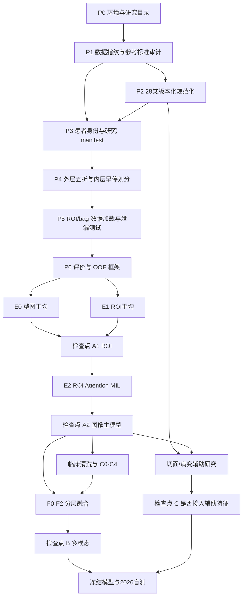

# 新一轮膝关节超声患者级多模态诊断研究实施计划 v1.0

## 文档状态

- 制定日期：2026-07-24
- 状态：P0～P6、E0/E1/E1-S/E2/E2-R/E3、C0～C4、S1、G0和H0均已完成并登记；A1以固定ROI输入关闭，A2以“无合格图像主模型”关闭，C3仅冻结为异常五分类临床参考；E2-C、F0～F2和Z1/Z2不是待执行项，分别因ADR-006停止或因无合格冻结模型而失去启动条件；S1a等待临床书面确认，S1b只能在S1a通过后另行预登记。
- 研究性质：回顾性、单一现有数据来源的模型开发与内部测试；来源机构和伦理信息待临床方补充
- 主要用途：研究阶段的患者级主要诊断辅助，不用于当前临床独立决策
- 研究策略：`docs/project/新一轮患者级多模态诊断研究方案_2026-07-24.md`
- 架构决策：
  - `docs/decisions/ADR-001-采用患者级六类主要诊断与分层多模态融合.md`
  - `docs/decisions/ADR-002-固定临床特征白名单与标注规范化前置条件.md`
  - `docs/decisions/ADR-003-限制单模型训练时间并保护本机CPU资源.md`

本文件把已经讨论清楚的研究策略进一步拆成可以逐项实现、检查、停止和验收的执行计划。

### 检查点0实际结果（2026-07-24）

- 冻结数据版本：`62ecb01c4d77`；
- 来源文件：16,809 个，约 2.14 GB；
- 版本化有效配对标注：4,622 份；
- 规范化类别：28 类，残留疾病前缀 0；
- 规范化对象：11,072 个，前后数量与坐标守恒；
- 本轮主要诊断纳入：967 名患者、4,543 张图像；
- 4,543 张图像全部具有合法且人工确认的 ROI；
- 异常组 767 名患者全部匹配 Excel；
- 跨诊断身份冲突：0；
- 外层五折每类人数极差不超过 1；
- 固定种子 `20260724` 可完全重复生成；
- 详细报告：`workspace/experiments/active/exp_2026-07_patient_multimodal_v1/reports/checkpoint0.md`。

---

## 一、研究问题与预设目标

### 1.1 主要研究问题

1. 只使用每名患者的全部膝关节超声 ROI 图像，能否识别其主要诊断？
2. 患者级 Attention MIL 是否优于“逐图判断后患者内平均”？
3. 在不利用诊断、身份、日期和检查缺失模式等捷径的前提下，加入年龄、性别和化验值能否稳定提高异常五分类及最终六分类性能？
4. 疾病无关病变分割和切面信息能否提供额外诊断增益，还是仅增加可解释性？

### 1.2 固定主要诊断类别

类别顺序固定为：

```text
0 正常
1 类风湿性关节炎（RA）
2 痛风性关节炎（GA）
3 脊柱关节炎（SPA）
4 骨性关节炎（OA）
5 损伤
```

滑膜囊肿患者不进入主要诊断研究，但不删除原始数据；囊肿仍可作为疾病无关影像表现。

### 1.3 主要终点

开发队列患者级五折 OOF `macro-F1`。

选择 macro-F1 是因为类别不平衡明显，尤其损伤只有 71 人；总体准确率容易被 RA、OA 等较大类别主导。

### 1.4 关键次要终点

- balanced accuracy；
- 总体准确率；
- 每类 sensitivity、specificity、precision、NPV 和 F1；
- one-vs-rest macro-AUC；
- Top-2 accuracy；
- Brier score；
- Expected Calibration Error；
- 患者级混淆矩阵；
- 患者 bootstrap 95% 置信区间；
- 推理耗时和显存占用。

所有主要诊断指标以患者为单位。单图指标只用于质量控制和错误解释。

### 1.5 探索性终点

- 切面分类的 macro-F1、每类召回率和患者切面覆盖率；
- 病变分割的 Dice、IoU、病变检出灵敏度和假阳性数；
- 切面/病变软特征对患者主要诊断的增量；
- 注意力最高图像与临床专家判断的一致性；
- 年龄、性别和化验缺失程度下的分层性能。

---

## 二、研究队列与数据冻结

### 2.1 开发队列

预期纳入：

| 主要诊断 | 患者数 | 有效图像 + JSON |
|---|---:|---:|
| 正常 | 200 | 754 |
| RA | 261 | 1,382 |
| GA | 129 | 721 |
| SPA | 94 | 450 |
| OA | 212 | 954 |
| 损伤 | 71 | 282 |
| **合计** | **967** | **4,543** |

这些是计划启动时的预期值，不直接写死为事实。正式 manifest 必须重新扫描；若有差异，先输出机器可读原因并暂停训练。

### 2.2 标签隐藏的 2026 队列

- 预期 225 名患者、1,819 张图像；
- 不参与任何训练、早停、超参数选择、模型选择、阈值选择和融合权重选择；
- 正式预测文件在客户揭示参考标准前生成、哈希并锁定；
- 客户返还参考标准后只进行一次正式时间外盲测评价；
- 该队列不是多中心外部测试，报告中必须称为“标签隐藏的时间外盲测”。

### 2.3 参考标准

当前目录和 Excel 中的诊断表示“主要诊断”，不表示完整合并症。

正式训练前需要临床方补充或确认：

- 主要诊断由谁确定；
- 使用了哪些临床标准；
- 是否由单名医生、会诊或病历最终诊断确定；
- 诊断与超声、化验的时间关系；
- 诊断不明确或后来改变时如何处理；
- 2026 队列参考标准的确定方法是否与开发队列一致。

论文和报告使用“参考标准”，不使用绝对化的“真实真值”表述。

### 2.4 数据版本目录

本轮研究 ID 预定为：

```text
knee_patient_multimodal_v1_20260724
```

建议的版本化数据登记目录：

```text
workspace/data/registry/knee_patient_multimodal_v1_20260724/
├── source_fingerprint.json
├── data_audit.json
├── patients.csv
├── images.csv
├── folds_outer.csv
├── folds_inner.csv
├── class_order.json
├── clinical_schema.json
├── label_mapping_28.json
└── private/
    └── identity_linkage.csv
```

`private/` 包含可能回连身份的信息，不进入 Git、MLflow、公开报告或模型包。

### 2.5 原始数据保护

- 不修改、移动或重命名 `workspace/data/raw/` 中的原始图像、JSON 和 Excel；
- ROI 训练时在内存动态提取，不落盘生成裁剪后的“新原图”；
- 28 类规范化标注写入本轮版本化派生目录；
- 旧 `shared_derived/cleaned/` 和历史实验保持不动，避免混入本轮结果；
- 所有训练只读取 manifest 明确列出的文件。

---

## 三、泄漏防护和纳入规则

### 3.1 图像纳入条件

一张图只有同时满足以下条件才进入主要诊断研究：

- 图像可正常解码为 RGB；
- 存在同名 JSON；
- `ultrasound_rect` 合法且在图像边界内；
- ROI 已人工确认；
- ROI 面积和宽高不低于预设最小值；
- 患者可以映射到唯一 `person_key`；
- 患者有唯一主要诊断参考标准。

不合格图像必须记录排除原因，不能静默忽略。

### 3.2 患者身份和分组

- 同一人的左右膝、重复检查、多个目录和多个编号必须使用同一个 `person_key`；
- `person_key` 只用于连接、分折和结果追踪，不进入模型；
- 患者姓名、原始目录名和完整路径不得写入训练日志；
- 跨疾病目录疑似同一人的记录先暂停，由临床方确认主要诊断后再纳入；
- 不能只按当前患者文件夹名做 group，因为文件夹可能因脱敏而改名。

### 3.3 临床字段白名单

主结果只允许：

```text
sex
age_years
esr_mm_h
crp_mg_l
anti_ccp_u_ml
rf_iu_ml
hla_b27
uric_acid
```

主结果禁止：

```text
诊断
编号、姓名、person_key
目录名、文件名、完整路径
病程原始文本
超声检查日期或诊断日期
Excel 是否存在
数据来源批次
原始疾病前缀区域标签
```

病程只在临床方确认其定义后，将纯时长转换为 `symptom_duration_days` 做次要消融。

### 3.4 28 类疾病无关标注前置检查

在任何分割、病变识别或病变特征融合前：

- 非 dry-run 执行 88 → 28 类规范化；
- 映射对象数守恒，不允许静默丢失对象；
- 类别名不得包含 GA、OA、RA、SPA、N、损伤、滑膜囊肿等来源前缀；
- 抽检规范化前后多边形数量和坐标完全一致；
- 生成完整数据覆盖报告；
- 数据加载器发现疾病前缀时直接拒绝训练。

### 3.5 图像中的非医学信息

即使只读取 ROI，也要抽检：

- ROI 内是否仍有患者姓名、日期、编号或医院文字；
- 彩色多普勒色标是否与疾病采集流程相关；
- 不同疾病是否集中来自特定设备、分辨率或导出格式；
- 图像尺寸和边框样式能否单独预测疾病。

建立“元数据/尺寸/设备代理特征”基线。如果这些非像素医学代理已经明显分类，必须做分层报告或进一步清洗。

---

## 四、五折与内部测试设计

### 4.1 外层五折

使用患者级：

```text
StratifiedGroupKFold(
    n_splits=5,
    shuffle=True,
    random_state=20260724,
)
```

- `y` 是六类主要诊断；
- `groups` 是真实患者 `person_key`；
- 每名患者恰好一次作为外层测试患者；
- E0～E5 以及辅助模块全部复用同一外层折；
- 外层测试折训练期间完全不可见。

每折预期至少约有：

- 正常 40 人；
- RA 52 人；
- GA 25～26 人；
- SPA 18～19 人；
- OA 42～43 人；
- 损伤 14～15 人。

### 4.2 内层早停

不能把外层测试折同时用作早停和模型评价。

每个外层训练集内部再建立固定的患者级分层训练/早停子集：

- 约 90% 外层训练患者用于参数更新；
- 约 10% 用于早停和选择最佳 epoch；
- 内层分组仍使用 `person_key`；
- 外层测试折只在模型固定后推理一次；
- 不根据外层测试折表现修改该折模型。

超参数若需要比较，先在固定内层开发方案中完成，再冻结后运行全部外层五折。

### 4.3 OOF 预测

所有开发患者最终得到一条由“未见过该患者”的模型生成的 OOF 预测。

必须保存：

```text
person_key
outer_fold
reference_class
prob_normal
prob_ra
prob_ga
prob_spa
prob_oa
prob_injury
top1
top2
image_count
model_id
```

不保存姓名或原始文件路径。

### 4.4 随机性

- 数据划分种子：`20260724`；
- 训练种子：`20260724 + outer_fold`；
- Python、NumPy、PyTorch、CUDA 和 DataLoader worker 均显式设种子；
- 开发模式优先使用确定性算法；
- 记录无法完全确定的 CUDA 操作；
- 固定软件版本和硬件信息。

选定最终模型后先重复外层 fold 0 和 fold 1 的另一随机种子：

- 若 macro-F1 变化均不超过 0.03，可停止额外种子实验；
- 若任一变化超过 0.03，则最终候选需要增加完整第二种子五折。

---

## 五、图像输入与患者 bag

### 5.1 ROI 读取

- 从原图按 `ultrasound_rect` 动态读取；
- 不读取 ROI 外像素；
- 使用 RGB，保留彩色多普勒；
- 保持宽高比，letterbox 到目标尺寸；
- letterbox 颜色使用训练折图像边缘像素统计得到的中性值，不使用类别信息；
- 记录原始尺寸、ROI 尺寸和缩放比例用于审计，但不作为模型特征。

### 5.2 图像增强

主实验采用保守增强：

- 水平翻转 `p=0.5`；
- 旋转不超过 ±7°；
- 平移不超过 5%；
- 缩放 0.90～1.10；
- 亮度和对比度不超过 ±15%；
- 轻度高斯噪声；
- 不做垂直翻转；
- 不用强饱和度变化，以免破坏多普勒颜色；
- 首轮不使用 Mixup、CutMix 或 Random Erasing。

增强只在训练集应用。

### 5.3 bag 构造

- 一个患者是一个 bag；
- 一张合格 ROI 图像是一个 instance；
- 训练时每名患者每轮最多随机抽取 6 张；
- 少于 6 张时不重复伪造图像，通过 mask 支持变长 bag；
- 推理时使用该患者全部合格图像，显存不足时分块编码后统一聚合；
- bag 中图像顺序打乱不应改变推理结果。

### 5.4 图像标准化

首轮使用与 ImageNet 预训练权重一致的标准化。

只有在 E2 完成后，才考虑数据集内均值/方差作为消融；不能同时改变骨干、输入尺寸和标准化方式。

---

## 六、预设实验矩阵

### 6.1 图像主线

| 编号 | 输入 | 患者聚合 | 骨干 | 目的 |
|---|---|---|---|---|
| E0 | 整图 | 每图 softmax 后患者内平均 | EfficientNet-B2 | 新数据整图基线 |
| E1 | ROI | 每图 softmax 后患者内平均 | EfficientNet-B2 | 单独检验 ROI |
| E2 | ROI | gated Attention MIL | EfficientNet-B2 | 图像主候选 |
| E2-C | ROI | gated Attention MIL | ConvNeXt-Tiny | 骨干挑战模型 |

固定 timm 模型：

```text
efficientnet_b2.ra_in1k
convnext_tiny.fb_in1k
```

两者均使用 ImageNet-1K 预训练，避免把更大预训练数据集带来的优势误记为骨干优势。

### 6.2 临床和融合主线

| 编号 | 输入 | 目的 | 是否可成为最终模型 |
|---|---|---|---|
| C0 | 最大类别 | 无信息基线 | 否 |
| C1 | 年龄 + 性别 | 人口学基线 | 否，诊断参考 |
| C2 | 六项化验是否缺失 | 工作流泄漏基线 | 否 |
| C3 | 允许的年龄、性别、化验值 | 临床数值五分类 | 可作为临床基线 |
| C4 | C3 + 显式缺失指示器 | 缺失偏差敏感性 | 否，除非以后外部证据支持 |
| F0 | E2 图像特征，异常五分类 | 图像条件基线 | 否，比较用 |
| F1 | E2 + C3，化验遮蔽 p=0 | 多模态对照 | 候选 |
| F2 | E2 + C3，化验遮蔽初始 p=0.15 | 稳健多模态候选 | 候选 |

年龄和性别不参与随机遮蔽。验证、外层测试和盲测关闭随机遮蔽。

### 6.3 辅助实验

| 编号 | 内容 | 启动条件 |
|---|---|---|
| V1 | 切面词典和 300～500 张试标 | 临床方能够参与定义和双人标注 |
| V2 | 切面分类 | V1 一致性达到预设门槛 |
| S1 | 28 类标签分布、重叠和穷尽性审计 | 28 类规范化完成 |
| S2 | YOLO-seg 实例分割 | S1 确认实例目标有效 |
| S3 | nnU-Net v2 2D | S1 确认可以构造无冲突语义 mask |
| A1 | E2 + 切面软特征 | V2 OOF 可用 |
| A2 | E2 + 病变软特征 | S2/S3 OOF 可用且无参考标准泄漏 |

辅助模块不阻塞 E0～E2 和 C0～F2。

---

## 七、默认训练配置

### 7.1 图像模型默认值

| 参数 | 默认值 |
|---|---|
| 输入尺寸 | 384 × 384 |
| 预训练 | ImageNet-1K |
| 优化器 | AdamW |
| encoder learning rate | `1e-4` |
| head/MIL learning rate | `3e-4` |
| weight decay | `1e-4` |
| scheduler | 3 epoch warm-up + cosine decay |
| 最大 epoch | 60 |
| 内层早停 patience | 10 |
| 早停指标 | inner macro-F1 |
| dropout | 0.30 |
| gradient clipping | 1.0 |
| mixed precision | FP16 AMP |
| 每患者训练图像上限 | 6 |
| 类别处理 | 患者级类别均衡采样 + 未加权交叉熵 |
| 资源试运行 | 每个新架构先跑 fold 0、5 epoch，最多 1 小时 |
| 单 fold 目标时间 | ≤ 10 小时 |
| 单 fold 软截止 | 11.5 小时，保存并安全退出 |
| 单 fold 硬截止 | 23.5 小时，外部 watchdog 终止 |

首轮不同时使用类别均衡采样和类别加权 loss，避免双重补偿。

### 7.2 RTX 3080 10GB 适配

实际 patient batch 由不超过 1 小时的 5 epoch 资源试运行决定：

- 首选每步 1～2 个患者；
- 使用梯度累积达到有效 8 个患者；
- 若 OOM，先减少并行患者数，不降低输入尺寸；
- 仍 OOM 时把每患者同批图像数由 6 降到 4，但保持跨 epoch 随机覆盖；
- 峰值显存不得超过约 9 GB，为桌面显示和 CUDA 波动保留空间；
- 记录峰值显存、GPU 利用率和温度、每 epoch 时间和吞吐量。

v1.0 固定 384 输入，不进行 448/512 消融。ConvNeXt-Tiny 只作为受控挑战模型：资源试运行预测单 fold 超过 10 小时或峰值显存超过 9 GB 时，不启动完整五折。

### 7.3 CPU、内存和运行时保护

默认配置：

```text
DataLoader num_workers = 2
prefetch_factor = 2
persistent_workers = true
torch intra-op threads = 4
torch inter-op threads = 1
OMP_NUM_THREADS = 2
MKL_NUM_THREADS = 2
OPENBLAS_NUM_THREADS = 2
NUMEXPR_NUM_THREADS = 2
OpenCV threads = 0
```

运行规则：

- 五个 fold 和不同模型全部顺序执行，任何时刻只运行一个训练进程；
- Windows 训练进程使用 `BelowNormal` 优先级；
- 启动前可用内存必须至少 8 GB；低于 4 GB 时在安全检查点停止；
- CPU 平均使用率持续 5 分钟超过 80% 时告警，并在下一 epoch 保存退出；恢复时把 `num_workers` 降为 1；
- 只有 CPU 平均低于 65% 且可用内存超过 10 GB，才允许把 `num_workers` 试调为 3，上限不超过 3；
- GPU 温度超过 83°C 持续时告警，超过 88°C 持续 5 分钟时安全停止；
- 11.5 小时达到软截止时完成当前 epoch、保存最佳权重和恢复状态后退出；
- 23.5 小时由独立 watchdog 执行硬截止，保证单次训练不超过 24 小时；
- 数据哈希、分割预处理和模型训练不得同时执行。

资源停止必须记录为 `TIME_BUDGET_REACHED` 或 `RESOURCE_GUARD_STOPPED`，不能伪装成正常完成。重新启动时必须从最后安全检查点恢复。

### 7.4 临床模型

临床基线按由简到繁：

1. multinomial logistic regression；
2. 小型两层 MLP；
3. 只有前两者明显欠拟合时再考虑树模型。

预处理：

- 所有单位和上下限表达先标准化；
- `<x`、`>x` 保存边界数值和 censoring flag，但主结果不输入原始字符串；
- 连续值使用训练折中位数插补；
- 插补和标准化参数只由当前外层训练数据拟合；
- HLA-B27 编码为阳性、阴性和中性缺失；
- 主结果不输入显式缺失 mask；
- C2/C4 单独量化缺失模式。

### 7.5 多模态融合

外层每折：

1. 从该折 E2 最佳图像模型初始化；
2. 图像 encoder 先冻结 5 个 epoch；
3. 训练临床 MLP 和融合头；
4. 再以 encoder `1e-5`、融合头 `1e-4` 小学习率联合微调；
5. 只在异常患者中输出 RA、GA、SPA、OA、损伤五类条件概率。

最终六类概率：

```text
P(正常) = P_image(正常)

P(d) = (1 - P_image(正常)) × P_fusion(d | 异常)
```

组合后必须检查六类概率和为 1。

---

## 八、统计分析和模型选择

### 8.1 OOF 汇总

每个实验只用患者级 OOF 预测形成主结果表。

报告：

- 五折逐折指标；
- 五折均值和标准差；
- 合并 OOF 指标；
- 2,000 次患者级分层 bootstrap 95% CI；
- 模型差异使用同一 bootstrap 样本做配对比较。

### 8.2 校准

- 判别指标先报告原始 OOF 概率；
- 使用跨折方式拟合温度缩放，不能用患者自己的参考标准校准其概率；
- 盲测模型的温度参数只用开发队列 OOF 拟合；
- 报告校准前后 Brier score、ECE 和可靠性图。

### 8.3 运行门槛

#### ROI 门槛：E1 对 E0

优先采用 ROI，如果同时满足：

- OOF macro-F1 不低于 E0 超过 0.02；
- 没有任何一类 sensitivity 下降超过 0.05；
- 非医学界面/文字泄漏审计更安全。

若 E1 明显低于 E0，检查 ROI 是否过紧；只允许预先定义一个“少量上下文边距”消融，不反复搜索边距。

#### MIL 门槛：E2 对 E1

E2 成为图像主模型需满足：

- OOF macro-F1 点估计至少提高 0.01，或在相近 macro-F1 下明显改善最差类别 F1/校准；
- 至少 3/5 折方向不差；
- bag 顺序不变性测试通过；
- 注意力权重不存在全部塌缩到单张图的系统性异常。

#### 多模态门槛：F1/F2 对 F0

宣称临床数据有增益需满足：

- 异常五分类 macro-F1 提高至少 0.02；
- 六分类 macro-F1 同方向改善；
- 至少 4/5 折不下降；
- 不是只在 C2“缺失模式”容易识别的类别上提升；
- 2026 时间外盲测未出现明显反向下降。

这些是工程决策门槛，不是已知临床最小重要差异。

### 8.4 模型选择优先级

1. OOF macro-F1；
2. 最差类别 F1 和 sensitivity；
3. 校准；
4. 结果在五折和随机种子间的稳定性；
5. 模型复杂度和推理成本。

不按某一折最好成绩、单次最高 accuracy 或盲测结果反向选模型。

若 EfficientNet-B2 与 ConvNeXt-Tiny 的 OOF macro-F1 差异小于 0.01，优先选择单 fold 更快、显存更低的模型。主结果不做跨骨干集成；只对最终选定骨干的五折模型做概率平均，避免用成倍训练和部署成本换取不确定的小幅收益。

---

## 九、错误分析和偏差分析

### 9.1 每名误判患者

输出脱敏错误分析表：

- 参考标准；
- Top-1、Top-2 和六类概率；
- 图像数量；
- 最高注意力图像的脱敏引用；
- 图像模型与融合模型是否一致；
- 实际可用化验数量；
- 是否为低置信度；
- 由临床专家填写的复核意见。

系统不自动生成“错误原因”的确定性医学结论。

### 9.2 固定亚组

- 男/女；
- 年龄 `<40`、`40–59`、`≥60`；
- 图像数 `1–3`、`4–7`、`≥8`；
- 化验完整度 `0–2`、`3–4`、`5–6`；
- 有/无彩色多普勒图；
- 采集年份；
- 图像尺寸或设备代理分组。

GA 开发队列目前全部为男性，因此不能声称模型已验证女性 GA 的性能。

### 9.3 失败模式

重点检查：

- RA 与 OA；
- SPA 与 RA；
- GA 合并 OA；
- 损伤与 OA；
- 轻症或缺少多普勒图像；
- 只有一张图或切面覆盖不足；
- 高注意力图像含非医学文字或界面元素。

---

## 十、切面和病变辅助研究

### 10.1 切面

临床方先制定词典，至少包括：

- 髌上囊纵切；
- 髌上囊横切；
- 其他明确标准切面；
- 非标准/无法判断。

试标 300～500 张，覆盖六类疾病、不同患者和设备。至少 20% 双人标注，报告 Cohen's kappa 或适合多类别的加权一致性。

一致性门槛由临床方在试标前确认。未达标时先修改定义，不扩大标注。

### 10.2 28 类病变/解剖标签

28 类规范化只是词汇层统一，训练模型前还要检查：

- 每类对象数和患者数；
- 罕见类别；
- 多边形是否互相重叠；
- 同一像素能否同时属于多个类别；
- 未标注是否代表阴性还是未知；
- 正常解剖和病变类别是否需要不同任务头。

若类别之间存在合法重叠，不能直接构造单一互斥的 nnU-Net 语义 mask。此时：

- YOLO-seg 用于实例级轮廓基线；
- nnU-Net 只训练可互斥的语义子集，或改为多标签通道方案；
- 不允许为迁就模型而静默覆盖重叠标注。

### 10.3 接入主要诊断的条件

切面/病变模块只有同时满足以下条件才接入主要诊断：

- 对外层测试患者的特征由未见过该患者的辅助模型产生；
- 类别名称疾病无关；
- 对 E2 的配对 OOF 增益稳定；
- 不需要人工真值 mask 才能推理；
- 推理流程与真实使用场景一致。

否则保留为独立的解释或辅助标注模块。

---

## 十一、实验追踪、环境和磁盘预算

### 11.1 当前资源

- GPU：NVIDIA GeForce RTX 3080，10,240 MiB；
- CPU：Intel Core i5-10400，6 核 12 线程；
- 内存：约 31.9 GB；调查时可用约 5.8 GB；
- Python：3.13.7；
- PyTorch：2.6.0 + CUDA 12.4；
- torchvision：0.21.0；
- timm：1.0.22；
- scikit-learn：1.8.0；
- Ultralytics：8.4.17；
- nnU-Net v2：已安装；
- MLflow Skinny：3.14.0，已完成本地 SQLite parent/child run 冒烟测试；
- C 盘剩余空间：约 39.5 GB；
- 现有 `shared_derived/`：约 7.12 GB；
- 现有实验目录：约 15.24 GB。

### 11.2 环境策略

由于只有 Python 3.13 且磁盘紧张，第一步不重复安装整套 PyTorch：

1. 冻结当前可工作环境的完整版本；
2. 安装与 Python 3.13 兼容的 MLflow；
3. 生成 `requirements-research-lock.txt` 和 `environment.json`；
4. 做 GPU、AMP、DataLoader 和 MLflow 冒烟测试；
5. 若兼容性失败，再评估单独环境，不直接破坏现有环境。

### 11.3 MLflow

建议使用本地 SQLite backend 和本轮实验独立 artifact 目录：

```text
workspace/experiments/active/exp_2026-07_patient_multimodal_v1/
├── README.md
├── manifest.yaml
├── journal.md
├── configs/
├── tracking/
│   └── mlflow.db
├── artifacts/
├── reports/
└── logs/
```

组织方式：

- 一个 E0/E1/E2 等实验是一个 parent run；
- 五个 outer fold 是 nested child runs；
- 记录 manifest、fold、配置和代码哈希；
- 每折只保留最佳 checkpoint；
- 不同时在普通目录和 MLflow artifact 中重复复制同一权重。

### 11.4 磁盘门槛

分割实验前磁盘风险最高。

- 主要诊断阶段新增空间预算不超过 12 GB；
- 不保存每个 epoch checkpoint；
- 不落盘保存 ROI 图像；
- normalized annotations 默认只复制 JSON/元数据，不复制原图；
- 空间低于 20 GB 时停止新增训练；
- 空间低于 15 GB 时禁止启动 nnU-Net 预处理；
- 清理历史权重或派生数据必须另行核对目标并获得确认。

### 11.5 单次训练资源预算

本计划把“一次训练”定义为一个配置、一个 outer fold、一个随机种子的独立 run：

| 项目 | 门槛 |
|---|---:|
| 新架构资源试运行 | 5 epoch，≤ 1 小时 |
| 正式 run 目标 | ≤ 10 小时 |
| 软截止 | 11.5 小时 |
| 硬截止 | 23.5 小时 |
| GPU 峰值显存 | ≤ 约 9 GB |
| 启动时可用内存 | ≥ 8 GB |
| CPU 持续告警线 | 平均 > 80%，持续 5 分钟 |

资源试运行用实际每 epoch 时间同时估算“预计早停时间”和“跑满 60 epoch 时间”。任一估算超过 10 小时，先优化数据加载、梯度累积和冻结策略；仍不通过则降低最大 epoch 或取消挑战模型，不削减外层五折，也不借用外层测试折早停。

调查时本机可用内存约 5.8 GB，低于启动门槛；正式训练前需关闭无关高内存程序或等待系统可用内存恢复，训练脚本不得直接抢占启动。

### 11.6 粗略计算预算

以单张 RTX 3080 顺序运行，所有阶段都受“每个独立 run 目标 10 小时、绝不超过 24 小时”的限制，实际以 5 epoch 资源试运行修正：

| 阶段 | 单 fold/run 预算 | 五折粗略总 GPU 时间 |
|---|---:|---:|
| 数据和冒烟测试 | ≤ 1 小时 | < 2 小时 |
| E0 | 2～4 小时 | 10～20 小时 |
| E1 | 2～4 小时 | 10～20 小时 |
| E2 | 3～6 小时 | 15～30 小时 |
| E2-C 挑战模型 | 仅资源试运行通过才估算 | ≤ 50 小时 |
| C0～C4 | 主要使用 CPU，单 run < 1 小时 | < 2 小时 |
| F0～F2 | 1～3 小时 | 5～15 小时 |
| 切面分类 | 1～3 小时 | 5～15 小时 |
| YOLO/nnU-Net 分割 | 每 run ≤ 10 小时目标 | 另立受控排期 |

这些不是工期承诺；每个阶段在检查点后再决定是否投入下一阶段。

---

## 十二、实施依赖图



---

## 十三、可实施任务

### P0：建立实验骨架和资源门槛

**目标：** 建立独立实验目录、环境快照、MLflow 本地追踪、磁盘保护、资源监控和墙钟时间 watchdog。

**可能涉及：**

- `requirements-research-lock.txt`
- `src/common_paths.py`
- `tools/19_check_research_environment.py`
- `tests/test_research_environment.py`
- `workspace/experiments/active/exp_2026-07_patient_multimodal_v1/`

**验收：**

- [x] GPU/AMP 冒烟训练通过；
- [x] MLflow parent/child run 可写可读；
- [x] 环境和 Git 状态被记录；
- [x] 磁盘低于门槛时脚本拒绝训练；
- [x] CPU/内存/GPU 温度监控和安全停止通过模拟测试；
- [x] 11.5 小时软截止与 23.5 小时硬截止可配置，测试中用缩短时间验证；
- [x] 训练进程为 `BelowNormal`，默认 `num_workers=2` 且不并行多个 fold；
- [x] 不复制现有模型权重。

**依赖：** 无
**规模：** 中

### P1：冻结数据来源和参考标准字典

**目标：** 生成源文件指纹、类别顺序、纳入排除规则和参考标准说明。

**可能涉及：**

- `tools/20_fingerprint_research_sources.py`
- `src/research_schema.py`
- `tests/test_research_schema.py`
- registry 中的 JSON/CSV

**验收：**

- [x] 原始文件 SHA-256 清单完成；
- [x] 类别顺序唯一且固定；
- [x] 滑膜囊肿明确排除；
- [x] 诊断列只进入参考标准审计，不进入特征；
- [x] 2026 队列与开发队列严格分开。

**依赖：** P0
**规模：** 中

### P2：生成版本化 28 类标注

**目标：** 在不覆盖旧数据、不复制原图的前提下生成完整 28 类疾病无关 JSON。

**可能涉及：**

- `tools/01_clean_labels.py`
- `tools/21_normalize_research_annotations.py`
- `src/label_mapping.py`
- `tests/test_label_mapping.py`
- versioned normalized annotation directory

**验收：**

- [x] 恰为 28 类；
- [x] 疾病前缀为 0；
- [x] 对象数守恒；
- [x] 图像/JSON 覆盖与审计一致；
- [x] 旧 `cleaned/` 未被覆盖；
- [x] 规范化前后坐标逐文件一致。

**依赖：** P1
**规模：** 中

### P3：建立患者 manifest 和身份审计

**目标：** 生成患者、图像、ROI、Excel 连接和私有身份映射。

**可能涉及：**

- `tools/22_build_research_manifest.py`
- `src/research_manifest.py`
- `tests/test_research_manifest.py`
- registry 中的 `patients.csv`、`images.csv`

**验收：**

- [x] 预期 967 人、4,543 图，或有逐条排除原因；
- [x] 同一实际患者只有一个 `person_key`；
- [x] 跨类别疑似重复有报告；
- [x] ROI 合法且确认状态完整；
- [x] MLflow/普通日志不含姓名和原始路径。

**依赖：** P1、P2
**规模：** 中

### P4：生成固定外层五折和内层早停划分

**目标：** 生成所有实验共用的患者级折。

**可能涉及：**

- `tools/23_build_patient_folds.py`
- `src/research_splits.py`
- `tests/test_research_splits.py`
- `folds_outer.csv`、`folds_inner.csv`

**验收：**

- [x] 每名患者恰好一个 outer fold；
- [x] person_key 不跨 outer train/test；
- [x] inner split 不包含 outer test；
- [x] 各类每折人数符合可接受范围；
- [x] 相同种子重复生成完全一致。

**依赖：** P3
**规模：** 小到中

### P5：实现 ROI、逐图和患者 bag 数据接口

**目标：** 提供 E0/E1/E2 共用且只改变指定变量的数据接口。

**可能涉及：**

- `src/research_dataset.py`
- `src/research_transforms.py`
- `tests/test_research_dataset.py`
- `tools/24_visualize_research_inputs.py`

**验收：**

- [x] E0 与 E1 只改变整图/ROI；
- [x] E1/E2 不读取 ROI 外像素；
- [x] letterbox 保持宽高比；
- [x] RGB 多普勒保留；
- [x] 变长 bag、随机抽 6 张和全图推理均通过；
- [x] 可视化抽检每折每类。

**实际结果（2026-08-02）：** 生成 5 个外层折 × 6 个类别共 30 组整图/ROI 对照；逐张检查确认 ROI 隔离外围设备界面并保留彩色多普勒。100 张实图预处理抽样中，ROI 吞吐量约 55.29 图/秒，整图约 37.26 图/秒。推理接口支持分块编码全部患者图像，结果与一次性编码一致。

**依赖：** P4
**规模：** 中

### P6：建立患者级评价、OOF 和 MLflow 框架

**目标：** 所有模型共用同一评价和产物契约。

**可能涉及：**

- `src/research_metrics.py`
- `src/research_tracking.py`
- `tests/test_research_metrics.py`
- `src/research_oof.py`
- `tests/test_research_oof.py`
- `tools/25_evaluate_patient_oof.py`

**验收：**

- [x] OOF 患者唯一且覆盖全部开发患者；
- [x] 概率和为 1；
- [x] macro-F1、每类指标、AUC、校准和 CI 可复现；
- [x] 配对 bootstrap 可比较两个实验；
- [x] patient-level 和 image-level 输出不会混淆。

**实际结果（2026-08-02）：** 使用不代表模型效果的合成概率对真实 registry 做合同冒烟测试，967/967 名患者和 5 个 outer fold 均完整通过。评价报告不写姓名或原始路径；完整测试套件共 58 项通过。

**依赖：** P4、P5
**规模：** 中

### E0/E1：完成整图和 ROI 可比基线

**目标：** 用同一骨干、折、增强和预算回答 ROI 是否有效。

**资源试运行结果（2026-08-02）：** E1 ROI fold 0 的 5 epoch 用时约 5.4 分钟，E0 整图约 6.7 分钟；两者 PyTorch 峰值分配显存均约 1.25 GB，外层测试患者均未迭代。E0 比 E1 慢约 23%，但两者均远低于 1 小时试运行和 10 小时单 fold 门槛。短试验分数只用于管线检查，不作为模型选择结果。ImageNet-1K 权重已固定为本地文件，SHA-256 为 `bcdf34b7ab5a07e20e8cd37d74f7f40ca398b5105e06c755342a9c7ffa892944`。

**正式五折结果（2026-08-02）：** E0 和 E1 均完成 967 名患者的固定五折 OOF。E0/E1 macro-F1 分别为 0.2014/0.2155；E1−E0 为 +0.0141，配对 95% CI 为 -0.0203～+0.0485。E1 的准确率和 Top-2 分别提高 0.0476 和 0.0796，但 SPA、损伤灵敏度分别下降 0.2447 和 0.0845，未达到预设类别安全门槛。详见 `docs/project/E0_E1整图与ROI五折基线结果_2026-08-02.md`。

**可能涉及：**

- `tools/26_train_patient_image_mean.py`
- `src/research_models.py`
- `tests/test_research_models.py`
- E0/E1 YAML 配置

**验收：**

- [x] 五折 E0 和 E1 均完成；
- [x] 外层测试折不参与早停；
- [x] OOF 人数与 manifest 一致；
- [x] ROI 性能门槛分析完成；
- [x] 非医学代理特征泄漏审计完成（结果为高风险，未通过）；
- [x] 每折仅保存最佳 checkpoint。

**依赖：** P6
**规模：** 中

### 检查点 A1：确认 ROI 输入

- [x] E0/E1 配对结果审阅；
- [x] 不扩展ROI边距：整图外部背景已证实为强代理；
- [x] 非医学信息审计完成并识别高风险；
- [x] E1-S 固定正方形拉伸敏感性消融完成；
- [x] 冻结后续图像输入方式：人工确认ROI、等比例letterbox至384×384，不加边距。

**非医学代理审计结果（2026-08-02）：** E0可见的整图边框和ROI外背景仅凭简单统计即可达到 macro-F1 0.3983；E1可见的ROI长宽比代理上界为0.2100，加入原始分辨率上界为0.2731，均显著高于置换零分布。E0退出最终候选，禁止扩大ROI边距。A1增加一次且仅一次E1-S固定正方形拉伸敏感性消融，详见 `docs/project/非医学采集与导出代理审计_2026-08-02.md` 和 ADR-004。

**A1输入决定（2026-08-02）：** E1-S五折macro-F1为0.1934，比E1低0.0222（配对95% CI -0.0564～0.0116），正常和OA灵敏度分别下降0.1100和0.1698，未通过总体与逐类门槛。停止stretch路线，不继续搜索其他几何变体；E2固定使用人工确认ROI的等比例letterbox输入。ROI长宽比/导出代理仍作为主要局限和时间外盲测风险。详见 `docs/project/E1S_ROI几何敏感性消融结果_2026-08-02.md` 和 Accepted ADR-004。

### E1-S：ROI 长宽比去捷径敏感性消融

**目标：** 在保留ROI全部像素的前提下去掉显式letterbox padding和原始长宽比，判断E1结果对采集几何代理的依赖。

**验收：**

- [x] 除 resize mode 外与 E1 配置一致；
- [x] fold 0 资源试运行通过；
- [x] 五折 OOF 完成（967名患者，无重复/遗漏）；
- [x] 与 E1 配对 bootstrap 和每类灵敏度比较完成；
- [x] 按预设门槛冻结后续 MIL 输入；E1-S为阴性并停止。

**依赖：** 非医学代理审计
**规模：** 小

### E2：完成患者级 gated Attention MIL

**目标：** 训练患者 bag 模型并与 E1 比较。

**可能涉及：**

- `tools/29_train_patient_mil.py`
- `src/research_mil.py`
- `tests/test_research_mil.py`
- E2 YAML 配置

**验收：**

- [x] 五折 OOF 完成；
- [x] bag 顺序不变性通过（单元测试）；
- [x] 单图和多图患者均可推理（单元测试）；
- [x] 保存患者级注意力摘要；
- [x] MIL 门槛分析完成：性能通过、pooled注意力塌缩率0.6225导致总体失败。

**E2实现冻结（2026-08-02）：** 标准gated attention使用`tanh`/`sigmoid`两支门控并在患者bag内masked softmax；E2与E1除患者聚合外保持一致。注意力仅作为模型重要性线索。预先把“多图患者最大注意力≥0.95的比例超过50%”定义为系统性塌缩风险；不得排除不利患者后重新计算。正式五折前先运行fold 0、5 epoch资源试运行，要求小于1小时、峰值显存不超过9GB、外层test不迭代，pilot分数不参与模型选择。

**E2资源试运行（2026-08-02）：** fold 0的5 epochs在0.1388小时内完成，峰值GPU分配/保留1.258/1.359GB，外层test未迭代，资源与隔离门槛通过；允许启动正式固定五折。

**E2正式进度（2026-08-02）：** 五折训练完成，macro-F1分别为0.2853/0.3470/0.3445/0.3367/0.4198，均高于E1同折。多图塌缩率为0.3245/0.6211/0.8148/0.6505/0.7000，后四折超过0.50门槛；性能与注意力安全出现冲突，失败信号保留，不改变阈值。正在合并OOF并按预设门槛形成A2决定。首次尝试的资源守卫误停、根因修复和原状态恢复均已保留。

**E2最终门槛结果（2026-08-02）：** 合并967名患者后macro-F1为0.3663（95% CI 0.3352～0.3975），比E1高0.1508（配对95% CI +0.1125～+0.1890），五折方向5/5为正；但943名多图患者pooled塌缩率0.6225，超过0.50，且ECE/Brier恶化。E2不直接晋级，检查点A2保持开放。ADR-005只允许一次固定系数0.05的归一化注意力熵正则E2-R；若失败不搜索第二强度。

**依赖：** 检查点 A1
**规模：** 中

### E2-C：骨干挑战和稳定性复核

**目标：** 只替换骨干，并检查最终候选的随机种子稳定性。

**可能涉及：**

- E2-C YAML 配置
- E2 复用训练脚本
- 稳定性报告

**验收：**

- [ ] ConvNeXt fold 0 的 5 epoch 资源试运行不超过 1 小时；
- [ ] 预测单 fold 不超过 10 小时且峰值显存不超过 9 GB；不满足则记录取消原因，不启动完整五折；
- [ ] ConvNeXt 与 EfficientNet 使用同折同预算；
- [ ] 不同时改变输入尺寸或增强；
- [ ] fold 0/1 第二种子完成；
- [ ] 是否需要完整第二种子有明确结论。

**依赖：** E2
**规模：** 小

**状态（2026-08-03）：** 已停止，非待执行。E2-R类别安全失败后，[ADR-006](../decisions/ADR-006-E2R未通过类别安全门槛并关闭A2.md)明确禁止恢复E2-C；替换骨干无法直接解决聚合和类别安全问题，且会扩大同一开发集上的顺序搜索。上述未勾选的资源与稳定性条目是“因停止决定未执行”，不是剩余任务。

### E2-R：单次归一化注意力熵正则补救

**目标：** 检验E2性能收益是否必须依赖极端单图注意力，同时避免在相同OOF上搜索多个正则强度。

**冻结变更：** 仅在训练损失中加入系数0.05的归一化`KL(attention || uniform)`；单图患者为0。其余输入、骨干、增强、优化器、折、seed和预算与E2完全一致。

**验收：**

- [x] fold 0的5 epoch资源/合同试运行通过；
- [x] 固定五折OOF完成；
- [x] pooled塌缩率0.3680，通过不超过0.50的门槛；
- [x] macro-F1 0.3623、相对E1 +0.1468且五折5/5高于E1，该组门槛通过；
- [x] 类别安全已审计：痛风/损伤F1较E2下降0.0863/0.0696，该门槛失败；
- [x] ECE 0.3641、Brier 0.9239，该组门槛通过；
- [x] 总门槛失败后停止，未尝试第二个正则强度。

**依赖：** E2、ADR-005
**规模：** 中

**实现冻结（2026-08-02）：** Git `0a7205b`；配置`configs/research/e2r_roi_gated_attention_entropy_b2.yaml`，SHA-256为`9c6bc8b66739371b640bf50e24c5d05b75fa1b457f7c4f1eb04aa9f06ed569c8`。完整测试99项通过，dry-run确认只改变训练期注意力正则且外层test不参与训练/早停。正式五折须等待fold 0资源pilot和产物审计通过。

**资源pilot结果（2026-08-02）：** fold 0的5 epochs用时0.0951小时，峰值GPU分配/保留1.258/1.359GB，外层test未迭代；总损失、分类损失和注意力KL均有逐epoch记录，数值稳定。资源与隔离门槛通过，允许启动正式固定五折；pilot分数不参与模型选择。

**正式进度（2026-08-02）：** 五折训练完成，macro-F1为0.3137/0.3279/0.3430/0.3907/0.3253，均高于E1同折；相对E2分别+0.0285/-0.0191/-0.0015/+0.0540/-0.0945。多图注意力塌缩率为0.2128/0.6316/0.7090/0.0538/0.2263，三折通过、两折失败；校准与相对E2表现存在折间不稳定。配置和门槛未改变，正在合并五折OOF、计算CI、每类F1变化和pooled注意力。fold 2首次资源拒绝亦保留。

**最终结果（2026-08-02）：** OOF macro-F1 0.3623（95% CI 0.3330～0.3908），比E1高0.1468，pooled注意力塌缩率0.3680，ECE/Brier为0.3641/0.9239；这些门槛通过。但痛风与损伤F1较E2下降0.0863/0.0696，超过0.05类别安全门槛。E2-R总体失败并按ADR-006停止，不搜索第二正则强度。

### 检查点 A2：冻结图像主模型

- [x] 图像 OOF 主报告完成；
- [x] 完成候选选择判断：无模型同时满足全部预登记门槛，不伪选主模型；
- [x] E1/E2/E2-R 配置、权重和 OOF 文件哈希完成；
- [x] 未查看 2026 参考标准。

**检查点结果（2026-08-02）：** 按ADR-006以“当前无合格图像主模型”关闭。E1仅为保守参考，E2仅为性能敏感性模型，E2-R为机制补救阴性结果。C0～C4可独立继续；F0～F2保持阻塞。完成临床阶段后，ADR-008仅为无attention的E3均值特征池化窄范围重开A2；原Attention MIL和骨干搜索停止决定不变。

### E3：患者级均值特征池化

**目标：** 区分E2的收益来自患者级训练还是可学习attention，以结构上不会发生单图注意力塌缩的等权embedding平均恢复图像候选。

**验收：**

- [x] E3与E1只改变患者聚合位置；
- [x] bag顺序不变、padding忽略、分块编码一致测试通过；
- [x] 配置、数据指纹、fold/seed、资源和正式门槛预登记；
- [x] fold 0资源pilot通过；
- [x] 五折OOF及相对E1/E2配对评价完成；
- [x] 总体、类别安全、校准和资源门槛全部审计；
- [x] 独立阶段报告与A2最终ADR完成。

**最终结果（2026-08-02）：** 合并macro-F1 0.3010（95% CI 0.2693～0.3331），相对E1 +0.0854且4/5折为正，校准通过；但低于0.3463总体门槛，正常/痛风/损伤F1较E2下降0.0591/0.1710/0.2267，类别安全失败。E3按ADR-009不晋级并停止聚合器搜索；A2仍无合格图像模型，F0～F2继续阻塞。下一步审计28类区域/病变标注，结果未知前不直接选择辅助模型。

### G0：患者级正常/异常图像门控

**目标：** 补齐ADR-001原始分层架构中尚未独立验证的图像门控：只用患者全部ROI图像估计正常/异常，不读取Excel或其存在性；异常五分类和条件概率融合仍留给后续F0～F2。

**当前状态（2026-08-03）：** 项目负责人已接受[G0预登记](G0患者级正常异常图像门控实验预登记_2026-08-03.md)和[ADR-013](../decisions/ADR-013-以独立正常异常图像门控重开分层融合.md)。配置`configs/research/g0_roi_normal_abnormal_gate_b2.yaml`以SHA-256 `4a06e647e6b1ba5e4223a4ec752110bf71b9bfc257e8b134271c508c9c53ed72`冻结；当前进入实现阶段，尚无权重、OOF或MLflow run。

**实现进度（2026-08-03）：** Git `93b49f9`已完成冻结配置验证和六类到正常/异常的标签映射硬门，拒绝配置漂移及诊断文字/编号不一致；28项相关测试通过。阈值、温度校准、训练入口和OOF评价尚未实现。

**统计合同进度（2026-08-03）：** Git `948d241`和`d75099f`完成inner-validation-only阈值选择、二分类患者指标、分层bootstrap和温度缩放；全异常捷径与outer-test拟合均有拒绝测试。训练入口和五折OOF门槛合并仍待实现。

**工程闭环（2026-08-03）：** Git `59b67d0`已完成单折训练、校准OOF、注意力审计、五折合并、全部统计/资源门槛、产物哈希与MLflow反查；专项28项和完整221项测试通过。详见[G0工程闭环独立结果](G0患者级正常异常门控工程闭环_2026-08-03.md)。当前无G0 MLflow run、权重或OOF；下一步仅运行fold 0五epoch资源pilot。

**资源pilot（2026-08-03）：** fold 0五epoch在0.115488小时内完成，峰值保留显存1.392578GB，CPU观测峰值56.3%，最低可用内存11.08GB，outer test未迭代；MLflow父子run、summary、history和checkpoint哈希对账通过。pilot分数不用于模型选择。详见[G0资源pilot结果](G0资源pilot结果_2026-08-03.md)。

**正式五折结果（2026-08-03）：** 合并AUC 0.8672（95% CI 0.8431～0.8898）、异常灵敏度0.9061、正常特异度0.5350和macro-F1 0.7293通过；但仅3/5折AUC≥0.75，fold 2/3 AUC仅0.6170/0.6221，且校准后ECE 0.1292高于0.10。按[ADR-014](../decisions/ADR-014-G0未通过折间稳定性和校准门槛并停止候选搜索.md)不冻结模型、不调门槛或训练第二候选，F0～F2继续阻塞。详见[G0五折结果](G0患者级正常异常门控五折结果_2026-08-03.md)。

**验收：**

- [x] 项目负责人确认草案假设、唯一候选和九项门槛；
- [x] ADR-013改为Accepted，配置在结果未知时冻结；
- [x] 标签、fold隔离、阈值、校准、隐私和资源测试通过；
- [x] fold 0资源pilot通过；
- [x] 从同一冻结方法基线顺序运行固定五折；
- [x] 合并967人OOF并一次性判断全部门槛；
- [x] 稳定性与ECE失败，按预登记停止并完整保留阴性结果；F0～F2不启动。

**依赖：** A1输入已冻结；不依赖S1a，不改变A2六分类停止决定。
**规模：** 中

### H0：G0折间异质性与非医学代理关联审计

**目标：** 在不训练新诊断候选、不改变ADR-014停止决定的前提下，检查G0失败折是否伴随测得的采集/导出/ROI代理偏移，以及这些代理能否在固定外层折预测G0错误。

**当前状态（2026-08-03）：** [H0正式结果](H0_G0折间异质性审计结果_2026-08-03.md)已完成；一次序列化失败尝试也独立保留。结果支持外部采集/导出关联和ROI边缘医学控制关联，不支持因果或复活G0。

**验收：**

- [x] 项目负责人确认H0范围、门槛和禁止事项；
- [x] 冻结YAML及输入/隐私合同通过；
- [x] fold偏移、三个错误目标和代理OOF一致性全部实现并测试；
- [x] CPU-only正式运行一次，阳性/阴性/不可估计结果全部登记；
- [x] 独立结果、必要ADR、ledger、主索引和文档—产物审计完成；
- [x] 不产生诊断权重、不查看2026标签、不恢复G0或F0～F2。

**依赖：** G0正式五折和ADR-014已完成；不依赖S1a。
**规模：** 中

### C0～C4：建立临床特征和偏差基线

**目标：** 清洗允许字段，量化人口学、化验值和缺失模式的贡献。

**可能涉及：**

- `tools/31_prepare_clinical_features.py`
- `tools/32_train_clinical_baselines.py`
- `src/research_clinical.py`
- `tests/test_research_clinical.py`
- clinical YAML 配置

**验收：**

- [x] 字段白名单测试通过；
- [x] 诊断、身份、日期和病程文本为 0 个输入字段；
- [x] 插补和缩放只在 outer train 拟合；
- [x] C0～C4 OOF 报告完整；
- [x] 缺失模式基线单独标记为偏差审计。

**依赖：** P4、检查点 A2 已形成决定（允许“无合格图像主模型”）；本阶段不消费图像模型
**规模：** 中

**实现进度（2026-08-02）：** 已完成冻结配置、只读Excel派生、严格字段白名单、工作簿列/私有连接键双重校验、折内插补/标准化、C0～C4 Logistic Regression、临床OOF/配对CI/MLflow/模型哈希合同和专项测试；正式五折及独立结果报告已完成。

**输入审计与预登记（2026-08-02）：** 767/767名异常患者连接通过，五本纳入工作簿列角色与私有连接键均0错误；派生表SHA-256为`1074255b63b76444e0f798fe4ab7e16793d5bcbbf8ddbeb558cd1d7553e2eaef`。C0～C4研究问题、模型、五折、seed、CPU预算、配对CI和解释门槛已在结果未知时冻结，详见独立输入决策文档；正式运行严格复用了该预登记。

**正式五折结果（2026-08-02）：** C3临床数值macro-F1为0.7185（95% CI 0.6836～0.7518），比C1高0.3056且五折5/5为正，五类F1均超过0.10，冻结为异常五分类临床参考。C2仅缺失模式即为0.5146，C4加入缺失指示器后为0.8050且比C3高0.0865，均触发预设工作流偏差判据，禁止晋级。依据ADR-007不启动MLP/树模型；完整结果、每类指标、OOF/配置/模型哈希和MLflow索引见独立C0～C4阶段报告。F0～F2仍因A2无合格图像候选而阻塞。

### F0～F2：完成异常五类融合和六类概率组合

**目标：** 比较图像条件模型、无化验遮蔽融合和随机化验遮蔽融合。

**可能涉及：**

- `tools/30_train_patient_fusion.py`
- `src/research_fusion.py`
- `tests/test_research_fusion.py`
- F0/F1/F2 YAML 配置

**验收：**

- [ ] 正常概率只来自图像；
- [ ] 异常条件概率覆盖五类；
- [ ] 六类概率和严格为 1；
- [ ] p=0 和初始 p=0.15 同折比较；
- [ ] 人为清空化验时仍能推理；
- [ ] 多模态门槛分析完成。

**依赖：** C0～C4、检查点 A2
**规模：** 中

**状态（2026-08-03）：** 停止/未启动，非待执行。A2、E3和G0均未冻结合格图像模型；ADR-014和ADR-015明确禁止用C3融合掩盖G0的折间不稳定。六项验收条目因不满足启动依赖而未执行；不得在当前数据上继续。

### 检查点 B：冻结临床融合策略

- [x] C2 缺失偏差已量化；
- [ ] F1/F2 与 F0 配对比较完成；
- [ ] 是否采用随机化验项遮蔽有数据结论；
- [ ] 冻结最终图像模型、融合模型和温度参数。

**状态（2026-08-03）：** 以`closed_without_fusion_candidate`关闭。C2已证实缺失工作流偏差，C3仅作异常五分类临床参考；F0/F1/F2因无合格图像输入而未执行，因此没有可冻结的六类融合模型或温度参数。未勾选项表示“不可达/未执行”，不是尚待调参。

### S/V：开展病变和切面辅助研究

**目标：** 在不阻塞主要诊断的前提下完成标签审计、试标和辅助模型。

**可能涉及：**

- 现有 `tools/03`～`08`
- 新标签审计测试
- 切面标注协议
- S/V 配置和报告

**验收：**

- [x] 28 类重叠和穷尽性审计完成；结论为跨类重叠显著且穷尽性未建立；
- [ ] nnU-Net/YOLO 的目标表达与标注结构一致；
- [ ] 切面试标一致性达到临床方预设门槛；
- [ ] 辅助模型产生严格 OOF 特征；
- [ ] 是否接入主要诊断由配对增益决定。

**依赖：** P2、P4、检查点 A2
**规模：** 拆成多个后续中型任务

**状态（2026-08-03）：** S1审计完成并拒绝直接28类平铺训练；S1a非临床工程已完成，真实执行受临床书面8+8确认硬门阻塞；S1b必须在S1a通过后另行预登记。nnU-Net/YOLO、切面模型、辅助OOF和诊断接入均不得提前启动。

**S1结果（2026-08-02）：** [独立阶段报告](区域病变标注监督审计结果_2026-08-02.md)已完成。28类合同通过；16类支持充分、3类有限、9类不足；检出4,346对跨类别正面积重叠；人工标注存在性代理macro-F1 0.8240（95% CI 0.8010～0.8466），高可分偏差门槛失败。ADR-010关闭S1并停止直接28类平铺路线。下一步S1a冻结临床本体、逐图穷尽性/阴性、重叠和ROI截断协议；完成前不启动正式辅助模型。

**S1a进度（2026-08-02）：** Git `db5112a`已新增覆盖全部28类的机器可读审阅本体和[补充标注协议草案](区域病变标注临床本体与补充标注协议草案_2026-08-02.md)，123项完整测试通过。草案规定只有`absent_visible`可作负例，`not_in_view`/`uncertain`/`legacy_unknown`必须从损失中mask，跨类重叠保留实例或独立通道，ROI越界实例裁切并标记复核。当前仍需临床确认滑膜、Doppler、结晶、软骨、骨皮质、囊肿本体、旧标注穷尽性和盲法复核八项问题，因此状态保持“进行中”。

**S1a复核队列准备（2026-08-02）：** Git `befc44e`实现确定性盲法抽样器；真实数据dry-run和写出均得到400张唯一图/323名患者，8目标各50图、每fold各10图，其中旧阳性和旧未标候选各半。公开CSV无诊断、患者键、fold、旧标注答案或路径，队列/更新后审计SHA-256分别为`aadc0b412bc958c95b87c89972856d6ef84026375e69bc50e61601895ce022a4`和`902a9376e2e3f8600dbf6e4bb418b670e61c752f8043c2629eeba8cd6d8e740a`。Git `bc41719`进一步实现双人完整性、分歧裁决、隐私和一致性/κ/bootstrap CI验收器；完整测试129项通过。当前配置门槛仍为`pending_clinical_confirmation`且状态为`draft_not_preregistered`，严格统计会拒绝执行；临床确认前不得开始正式复核或训练。

**S1a预览工具（2026-08-02）：** Git `812067d`实现独立的诊断盲法ROI只读窗口；内部解析私有关联但界面只显示伪匿名病例号、目标和ROI像素，不显示诊断、旧多边形、文件名或路径。左右键/按钮可导航，状态文字明确“不记录、不训练”，中文字体和读取失败状态已验证。真实400图队列首图offscreen smoke test及视觉截图通过，完整测试133项通过。正式录入仍被协议冻结状态守住，不因预览器可用而提前开始复核。

**S1a非临床工程检查点（2026-08-02）：** [独立阶段结果](S1a盲法复核工程准备结果_2026-08-02.md)已形成。Git `3130d6d`增加400图ROI全量加载审计；干净提交重跑得到400/400成功、0失败、4.6109秒，报告SHA-256为`c329f17eb58160485d2c8e45c7aaf3cd645f4e5867b1e395de46c9e264ba00de`，完整测试134项通过。至此本体草案、确定性盲法队列、双人验收合同、只读预览和全量输入可用性均完成；计划状态从“工程准备”转为“临床确认/预登记冻结”。正式录入、训练和一致性统计仍禁止启动。

**S1a临床确认包（2026-08-03）：** [独立准备结果](S1a临床确认包准备结果_2026-08-03.md)已形成。五页工作簿将八项医学定义和八项研究流程参数分开，黄色输入区、下拉状态、数值校验和公式总门控均已验证；工作簿SHA-256为`b0247dc30cbd75a3403baeff9e8475ab1a5063fd4826801cce0afb43f3b6aab2`。状态仍为Draft，建议阈值没有写入正式配置。当前计划的唯一进行中项为取得书面确认并生成全新冻结配置/队列哈希。

**S1a临床确认机器门（2026-08-03）：** [独立阶段结果](S1a临床确认机器门结果_2026-08-03.md)和[ADR-011](../decisions/ADR-011-临床确认通过机器门后才允许冻结S1a.md)已形成。确认YAML SHA-256为`9abab1f7e2f783f3da451a000c1e5dce959976ab64a2e76073bfeacb86b9d0e7`；首次干净Git `0353e5e`空白模板审计通过8+8合同、隐私和5页XLSX结构，历史报告SHA-256为`ba9f394b2f238cc4ff55270de171fadab98ab963c630f0f4e0e06a7fd89c5231`，但`ready_for_preregistration=false`。验证器不修改现有配置；合同不兼容或缺失真实ADR时拒绝生成补丁。等待临床回表状态不变。

**S1a工作簿/YAML对账检查点（2026-08-03）：** Git `e018097`和`683a005`补齐完成工作簿固定单元格只读提取及严格模式逐项对账，覆盖Q1～Q8选项/定义/理由/角色/日期、P1～P8类型化值/理由和双签署；姓名只转为存在性布尔值，差异错误仅列安全字段编号。专项24项、当时完整158项及编译检查通过；干净Git `683a005`空白模板历史审计SHA-256为`428f1e409cf046eb5f7b672a3404ad60a27ca65949bfc7d5add2b68f369cbe2d`、运行0.1194秒且仍为`ready=false`，最新覆盖式报告见后续录入工程检查点。独立结果见[S1a临床确认工作簿对账检查点](S1a临床确认工作簿对账检查点_2026-08-03.md)。真实回表尚未收到，严格对账、S1a冻结、正式复核和病变训练仍未启动。

**S1a正式语义复核录入工程（2026-08-03）：** [独立阶段结果](S1a正式语义复核录入工程准备结果_2026-08-03.md)和[ADR-012](../decisions/ADR-012-拆分S1a语义复核与S1b几何可靠性复核.md)已形成。协议/代码交叉审计发现当前CSV没有独立几何，且“旧多边形不可见”与“选择保留/调整”冲突；因此S1a固定为盲法语义/存在性，几何可靠性改由S1b另行预登记。Git `208c8d2`、`db5f7c4`和`f5abe66`完成两复核者独立文件、Qt录入、原子保存、哈希/Git门和受控合并，并修复Git自引用死锁；Git `30683b9`修复临床审计报告被配置变化覆盖的问题。19项专项、177项完整测试通过；更新后配置SHA-256 `ffe31cdcb59a3b7fe55f30cdcf99d49def93ae754b490bdd629344107478a17c`。干净Git `f5abe66`真实Draft启动在写文件前按预期拒绝；干净Git `5d699ce`版本化空白确认审计SHA-256为`8de2004d4ece0c133d39f1d088e2d7e5fbd6a10026d0ab4387ff78d276d962db`且仍为`ready=false`。没有产生真实响应；S1b未开始。

**S1a盲法分歧裁决工程（2026-08-03）：** [独立阶段结果](S1a盲法分歧裁决工程准备结果_2026-08-03.md)已形成。Git `e2956cc`实现盲法裁决窗口、受控裁决启动器、裁决响应清单、存在状态/子型一致性门，并让最终一致性统计在严格模式下先验证完整裁决。裁决者只能处理双方有分歧的语义字段，不能覆盖一致字段，不显示诊断、旧标注、姓名、文件名或原始路径；合成裁决界面截图SHA-256 `41af7de83720119d3f65a8cd12ce14f868bf754fd7ee51b00211a2ab02f6d3c0`。专项30项通过，当前Draft真实启动仍在写入前拒绝。真实双人复核、真实合并、真实裁决和一致性统计必须等临床确认后按顺序执行。

### Z1：冻结并运行 2026 盲测

**目标：** 在参考标准揭示前生成锁定预测。

**可能涉及：**

- `tools/31_freeze_and_infer_2026.py`
- `src/research_inference.py`
- `tests/test_research_inference.py`
- 冻结 manifest 和 prediction CSV

**验收：**

- [ ] 代码、配置、数据清单、权重、类别顺序有 SHA-256；
- [ ] 2026 Excel 重新通过字段泄漏审计；
- [ ] 225 人全部有预测或有明确失败原因；
- [ ] 概率和为 1，患者键唯一；
- [ ] 预测文件在揭示参考标准前锁定。

**依赖：** 检查点 B；辅助模块是否接入由 S/V 决定
**规模：** 中

**状态（2026-08-03）：** `not_startable_no_qualified_frozen_model`。当前没有同时通过预登记门槛的图像或融合模型，所以不对225人生成用于效果展示的锁定诊断。标签隐藏队列继续隔离；只有新的独立预登记研究冻结合格模型后才可恢复Z1。

### Z2：一次性盲测评价和最终报告

**目标：** 客户返还参考标准后生成最终统计和错误分析。

**验收：**

- [ ] 不重新训练或改阈值；
- [ ] 图像模型和融合模型同时报告；
- [ ] 主要指标、CI、校准、亚组和错误分析齐全；
- [ ] 明确单来源、回顾性和参考标准限制；
- [ ] 生成模型卡、数据说明和临床复核材料。

**依赖：** Z1、客户返还参考标准
**规模：** 中

**状态（2026-08-03）：** 受Z1及客户参考标准双重阻塞。当前可以持续生成开发阶段综合报告，但不得写成已完成时间外盲测或已交付模型。

---

## 十四、阶段检查点与停止规则

### 检查点 0：数据可训练

必须全部满足：

- manifest、身份审计、28 类规范化和五折完成；
- 原始数据未修改；
- 无诊断/身份/日期泄漏；
- 磁盘和环境门槛通过。

否则不启动正式训练。

### 检查点 A：图像主模型

E0、E1、E2 必须有完整 OOF。若 E2 不优于简单平均，最终图像模型可以采用 E1，不为了“模型更先进”强行选择 MIL。

### 检查点 B：多模态

若 F1/F2 没有稳定优于 F0，最终交付仍以图像模型为主，临床融合报告为阴性结果，不重复调参直到“变好”。

### 检查点 C：辅助模块

若切面或病变软特征不提高 OOF 诊断，它们保留为独立解释/标注工具，不接入最终诊断。

### 检查点 D：盲测

盲测性能低于内部 OOF 时：

- 先报告分布漂移和失败模式；
- 不用同一 2026 队列调参后再次称为盲测；
- 后续改进版本必须使用新的外部或前瞻性队列评价。

---

## 十五、最终交付物

### 15.1 数据与复现

- 脱敏研究 manifest；
- 外层五折和内层早停划分；
- 28 类映射及审计报告；
- 临床字段字典；
- 数据和环境指纹；
- 所有实验 YAML 配置。

### 15.2 模型与预测

- 每折最佳图像 checkpoint；
- 必要时的融合 checkpoint；
- 开发队列患者级 OOF 预测；
- 2026 锁定盲测预测；
- 患者级推理入口。

### 15.3 报告

- E0～E2 图像对照报告；
- C0～F2 临床和融合报告；
- 五折稳定性、bootstrap CI 和校准报告；
- 错误病例和偏差分析；
- 辅助切面/病变报告；
- 模型卡和研究限制；
- 客户版结果说明。

### 15.4 不作出的声明

本轮不能直接声称：

- 模型已可独立用于临床诊断；
- 模型识别所有合并疾病；
- 2026 队列等同多中心外部测试；
- 注意力图就是病变定位；
- 女性 GA 或其他缺失亚组性能已充分验证；
- 内部最高单次指标代表真实部署性能。

---

## 十六、报告规范和技术依据

研究记录和最终报告同时参考：

- [STARD-AI](https://www.nature.com/articles/s41591-025-03953-8)：诊断准确性研究的数据集、AI index test、偏差、公平性和可推广性报告；
- [CLAIM 2024](https://pubs.rsna.org/doi/10.1148/ryai.240300)：医学影像 AI 的透明性、可复现性、图像采集和参考标准报告；
- [TRIPOD+AI](https://www.bmj.com/content/385/bmj.q902)：多变量诊断预测模型开发和测试报告；
- [PyTorch Reproducibility](https://docs.pytorch.org/docs/stable/notes/randomness)：随机种子、确定性算法和 DataLoader worker 复现；
- [StratifiedGroupKFold](https://scikit-learn.org/stable/modules/generated/sklearn.model_selection.StratifiedGroupKFold.html)：类别分层和患者 group 隔离；
- [timm Feature Extraction](https://huggingface.co/docs/timm/feature_extraction)：统一提取预训练骨干 pooled feature；
- [MLflow Tracking](https://mlflow.org/docs/latest/ml/tracking/)：experiment、parent/child run、数据和产物追踪；
- [Attention-based Deep Multiple Instance Learning](https://proceedings.mlr.press/v80/ilse18a.html)：置换不变的患者 bag attention pooling；
- [nnU-Net v2](https://github.com/MIC-DKFZ/nnUNet)：医学图像语义分割基线；
- [Ultralytics Segmentation](https://docs.ultralytics.com/tasks/segment/)：实例分割基线。

---

## 十七、建议的实际开工顺序

第一批只实现 P0～P4：

1. 建立实验骨架和资源门槛；
2. 冻结数据来源和参考标准字典；
3. 生成版本化 28 类标注；
4. 建立真实患者 manifest；
5. 生成外层五折和内层早停划分。

完成“检查点 0”并人工审阅患者数、类别数、泄漏审计和折分布后，再实现 P5/P6 和 E0。这样即使后续模型方案调整，最重要的数据基础也不需要返工。

---

## 十八、现有数据异常五分类受控融合探索（2026-08-03）

项目负责人明确要求在暂时不能提供新数据的条件下继续研究，并批准“既有OOF互补性检查→专用异常五分类图像D0→图像+Excel F0/F1”的风险优先顺序。[ADR-016](../decisions/ADR-016-以异常五分类OOF互补性门重开受控融合探索.md)只在异常患者条件五分类范围内重开探索；G0失败、完整六分类不可用和2026隔离决定不变。

### X0：既有OOF互补性门

- [x] 研究问题、单一固定融合权重、输入哈希和晋级门在结果未知时冻结；
- [ ] 严格连接767名异常患者的E2与C3 OOF；
- [ ] 输出条件图像、C3、固定融合的总体/逐类/逐fold结果与配对CI；
- [ ] 同时报告正反错误互补性；
- [ ] 按A/B门决定是否允许D0，不搜索权重。

预登记见[X0异常五分类图像—临床OOF互补性检查](X0异常五分类图像临床OOF互补性检查预登记_2026-08-03.md)。

### D0与F0/F1

D0只有在X0固定融合门或错误挽救门至少一组通过后才可另行预登记。D0固定人工确认ROI、EfficientNet-B2、患者级Attention MIL和五个异常类别；不得搜索骨干。D0通过性能、类别安全、校准、注意力与资源门后，才比较F0无随机化验遮蔽和F1固定15%随机遮蔽。正常组不进入该融合训练，显式缺失指示器不进入模型。
