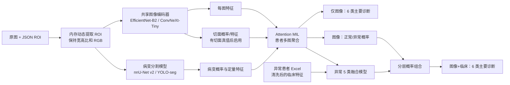

# 新一轮膝关节超声患者级多模态诊断研究方案

## 文档状态

- 日期：2026-07-24
- 状态：拟定，待项目负责人和临床方确认后实施
- 详细实施计划：`docs/project/新一轮患者级多模态诊断研究实施计划_v1.0_2026-07-24.md`
- 适用数据：
  - `workspace/data/raw/膝关节已标注`
  - `workspace/data/raw/膝关节2026未标注`
- 客户原始要求：`workspace/data/raw/训练要求.txt`
- 关联决策：`docs/decisions/ADR-001-采用患者级六类主要诊断与分层多模态融合.md`

## 一、结论摘要

客户提出的“切面识别 → 病变识别/分割 → 患者多图汇总 → 五折验证”总体方向合理，尤其是“同一患者的全部图像作为一个 bag”这一点，是本轮训练相对旧方法最重要的改进。

本项目建议采用以下研究定义：

1. **主要诊断任务改为患者级 6 分类**：
   - 正常
   - 类风湿性关节炎（RA）
   - 痛风性关节炎（GA）
   - 脊柱关节炎（SPA）
   - 骨性关节炎（OA）
   - 损伤
2. **滑膜囊肿不参加本轮主要诊断研究**。原始数据不删除，只在研究清单和数据划分中排除。囊肿仍可作为一种伴随影像表现保留在病变标注体系中。
3. 现有疾病目录表示的是**主要诊断**，不是互斥的全部疾病真值。模型的 6 分类概率只能解释为“主要诊断概率”，不能解释为“患者是否同时患有 OA 等所有疾病”。
4. 另设一个**疾病无关的多标签影像表现任务**，识别滑膜增生、积液、骨赘、骨侵蚀、痛风石、结晶、多普勒血流等表现。它用于解释诊断，也用于表达 RA、GA、SPA 或损伤患者可能伴随的 OA 表现。
5. 第一阶段完成**仅图像的患者级诊断**；第二阶段完成**图像 + Excel 的分层融合诊断**。
6. 因正常组没有 Excel，不能直接把“缺少 Excel”作为六分类模型的输入，否则模型会学到“无化验单 = 正常”的数据捷径。第二阶段应采用：
   - 图像模型判断正常/异常；
   - 只在异常患者中，用图像 + 临床数据判断 RA、GA、SPA、OA、损伤；
   - 再将两个概率组合成最终六分类概率。
7. `膝关节2026未标注` 作为**标签暂时隐藏的时间外盲测队列**。训练、模型选择、阈值和输出格式冻结后再预测；客户返还真值后只做一次正式盲测评价，不用它反向调参。
8. 切面识别、病变分割和主要诊断模型应分别评估，最后使用软概率或特征融合；不采用会把前级错误强制传给后级的硬串联。

## 二、当前数据基础

### 2.1 已标注开发队列

同步后的原始数据共有 994 名患者、4,622 个“图像 + 同名 JSON”有效配对样本，配对样本的超声有效视野 ROI 已完成人工确认。

| 主要诊断 | 患者数 | 有效配对图像数 | 本轮处理 |
|---|---:|---:|---|
| 损伤 | 71 | 282 | 纳入 |
| 正常 | 200 | 754 | 纳入；无 Excel |
| 滑膜囊肿 | 27 | 79 | 排除主要诊断研究 |
| 痛风性关节炎 | 129 | 721 | 纳入 |
| 类风湿性关节炎 | 261 | 1,382 | 纳入 |
| 脊柱关节炎 | 94 | 450 | 纳入 |
| 骨性关节炎 | 212 | 954 | 纳入 |
| **本轮合计** | **967** | **4,543** | **6 类主要诊断** |

每名患者图像数中位数约为 4，最大约为 17。因此，把每张图独立当成一个患者会错误放大多图患者的权重，也无法表达同一患者多个切面之间的互补信息。

### 2.2 ROI 的价值

已确认的 `ultrasound_rect` 中位面积约为整图的 38.4%，10%～90% 分位约为 27.2%～50.4%。这意味着整图中约六成像素通常是设备界面、文字或超声有效视野之外的内容。

本轮训练应：

- 保留原始图像文件不变；
- 在数据加载时根据 JSON 中的 `ultrasound_rect` 动态读取 ROI；
- 只把 ROI 内的像素送入模型；
- 不把裁剪结果另存为新的“原始图像”；
- 使用保持宽高比的缩放和留边，不把图像直接拉伸变形；
- 保留 RGB 三通道，以免丢失彩色多普勒信息。

ROI 是否真正提高诊断性能必须通过同一数据、同一划分、同一骨干网络的全图/ROI 对照实验验证，不能只凭直觉认定。

### 2.3 Excel 数据

六个异常疾病目录的 Excel 可以覆盖全部 794 名非正常患者；正常组没有 Excel。`SPA35` 与 `spa35` 一类差异需要使用不区分大小写的连接规则。

主结果建议使用的公共字段：

- 性别
- 年龄
- ESR
- CRP
- 抗 CCP / ACCP
- RF
- HLA-B27
- 尿酸

明确不进入模型的字段：

- 患者编号和姓名等身份字段；
- Excel 中的“诊断”列；
- 病程原始文本；
- 超声检查日期；
- 无业务含义的未命名列。

病程只作为预设的次要消融：客户确认其含义为“诊断前的症状持续时间”后，只提取纯数值时长，不保留疾病名、病因或自由文本。

这些字段必须先统一单位、文本表达和缺失值。例如“阴性/阳性/未查”、`<` 或 `>` 限值、数字字符串不能直接原样送入网络。所有插补、缩放和编码器只能在当前训练折上拟合，再应用到验证折，防止数据泄漏。当前不同疾病的化验缺失模式差异很大，主结果不把缺失指示器作为显式特征，并通过随机化验项 dropout、缺失模式基线和敏感性实验评估临床工作流捷径。详见 `docs/project/Excel训练特征与标签泄漏审计_2026-07-24.md`。

2026-07-24 项目负责人确认采用上述字段白名单。随机化验项遮蔽建议从 `p=0.15` 开始，只在训练时作用于原本有值的六项化验；验证和推理时关闭，并保留 `p=0` 对照。遮蔽概率在实现训练流程时确认。正式决策见 `docs/decisions/ADR-002-固定临床特征白名单与标注规范化前置条件.md`。

### 2.4 标签暂时隐藏的 2026 队列

`workspace/data/raw/膝关节2026未标注` 共有 225 名患者、1,819 张图像和覆盖 225 人的 Excel。该队列当前没有像素 JSON 和主要诊断真值，但客户保存着诊断真值。

它不参加：

- 模型训练；
- 内部五折划分；
- 超参数选择；
- 阈值选择；
- 模型之间的取舍。

它只用于冻结后的盲测推理和后续一次性评价。

## 三、对客户三阶段建议的专业评估

| 客户建议 | 判断 | 本项目调整 |
|---|---|---|
| 每张图先识别切面 | 合理，但当前不能直接训练 | 现有 84/88 个区域标签是解剖结构或病变，不包含标准化的“纵切/横切”真值；需先制定切面词典并补标 |
| 用 nnU-Net v2 / YOLO11-seg 找病变 | 合理 | 先把疾病前缀标签映射为疾病无关的影像表现，并审计“未标注是否真的代表不存在” |
| MedSAM 保留 | 合理 | 官方实现需要框提示时，应称为半自动分割/标注工具，不作为无人干预的病变定位主模型 |
| 同一患者多图合并判断 | 完全正确 | 使用 Attention-based MIL；bag 是患者，instance 是该患者的一张 ROI 图像 |
| 五折交叉验证 | 正确 | 必须按真实患者分组并尽量分层，每位患者只能进入一个折；输出全体开发患者的 OOF 预测 |
| 单张图给出最终疾病结论 | 不建议作为主结果 | 单图概率可以保留用于解释，但主要评价单位必须是患者 |

客户建议中最需要避免的是“硬串联”：如果先把一张图硬判为某个切面，再只送入对应病变模型，切面错误会直接导致后续全部失败。推荐将切面概率、病变概率和图像特征作为软信息输入患者级聚合模型，同时保留直接图像特征通路。

## 四、建议的总体架构



### 4.1 图像编码器

首轮建议：

- **EfficientNet-B2**：主基线，参数量和过拟合风险较适合当前规模；
- **ConvNeXt-Tiny**：受控挑战模型，先通过单折资源试运行，再用相同折和训练预算比较；
- v1.0 固定输入尺寸 384，不进行 448/512 实验；
- 训练时每个患者每轮最多随机抽取 6 张图，推理时使用该患者全部合格图像；
- 不再同时叠加 WeightedRandomSampler 和强类别加权交叉熵。优先采用患者级均衡采样，必要时再比较轻度类别权重或 focal loss。

本机训练固定使用 RTX 3080 10 GB，并保护 i5-10400 和 32 GB 内存供日常使用。每个配置、每个 outer fold、每个种子的独立训练目标不超过 10 小时，11.5 小时软停止并保存，23.5 小时由 watchdog 硬停止；不同 fold 和模型不得并行。完整资源约束见 `docs/decisions/ADR-003-限制单模型训练时间并保护本机CPU资源.md`。

旧 EfficientNet-B0 是逐图训练、整图拉伸到 384×384，测试集图像级 Accuracy 为 0.5719、macro-F1 为 0.4016。该结果只能作为历史参考；新数据、新六分类、新 ROI 和患者级评价下必须重做可比基线。

### 4.2 切面识别模块

客户提出的切面识别对质量控制、标准切面覆盖率和错误解释很有价值，但现阶段缺少切面真值。

实施顺序：

1. 由临床方确认切面词典，至少明确：
   - 髌上囊纵切；
   - 髌上囊横切；
   - 其他标准切面；
   - 无法判断/非标准切面。
2. 先抽取 300～500 张覆盖六类疾病、不同设备和不同患者的代表图像做试标。
3. 至少对一部分图像进行双人标注并计算一致性；歧义大的定义先修改，再扩大标注。
4. 使用 EfficientNet-B2 和 ConvNeXt-Tiny 做每图分类基线。
5. 输出切面概率和患者切面覆盖率，不用单个硬标签强制路由主要诊断。

在切面真值准备好之前，患者级图像诊断可以先开始，切面模块不应成为阻塞项。

### 4.3 病变识别与分割模块

现有区域标签包含疾病前缀，例如 `RA骨赘`、`OA骨赘`、`GA积液`。直接使用这些类别会把主要诊断答案编码进病变标签，也会把同一种表现拆成许多小类别。本轮应映射为疾病无关的影像表现，候选词典包括：

- 滑膜增生/滑膜异常
- 彩色多普勒血流
- 积液
- 骨侵蚀
- 骨赘
- 软骨异常
- 结晶/双轨征
- 痛风石
- 肌腱或韧带损伤
- 囊肿

2026-07-24 的全量标签审计已经验证 88 个原始类别可以逐项映射为 28 个疾病无关区域类别，规则结果中没有残留疾病前缀。完整映射和暂不自动合并的医学歧义项见 `docs/project/像素区域标签规范化记录_2026-07-24.md`。

但当前 `clean_report.json` 仍是 dry-run，实际 `category_mapping.json` 仍包含 84 个旧疾病前缀类别，旧 `cleaned/` 也没有覆盖当前完整数据。因此在训练分割或病变模块前，必须重新执行非 dry-run 清洗并校验 28 类缓存，不能直接沿用现有训练产物。

2026-07-24 项目负责人确认把“重新生成并校验 28 类标注”登记为以后正式训练前的强制前置任务，本次不立即执行。

正式训练前必须抽检标注完整性。若标注人员只画了最明显的区域，没有穷尽一张图中的所有病变，则“没有多边形”不能直接当成“病变不存在”，否则病变存在性模型会获得大量假阴性标签。遇到这种情况：

- 分割训练只把已标区域视为可靠阳性；
- 病变存在性使用“未知”而不是强制负样本；
- 先让临床方补充一小批穷尽式标注，作为可靠验证集。

模型定位：

- **nnU-Net v2 2D**：疾病无关语义分割的精度基线；
- **YOLO11-seg**：实例级轮廓、速度和历史连续性基线；先锁定当前 Ultralytics 版本，完成可比结果后再决定是否增加更新模型；
- **MedSAM**：给定医生框/提示后的半自动标注或交互式分割；
- 当前 ROI 多边形 Mask R-CNN 自动模型精度不足，不作为诊断流水线的强制前置条件。

旧数据上的 YOLO11 合并标签实验可以作为工程参考，但新增数据和患者折已经变化，必须按本轮疾病无关词典和固定五折重新训练，不能把旧指标直接当作本轮结果。

病变模块即使尚未达到自动诊断所需精度，也可先作为解释和辅助标注工具。只有当它在相同 OOF 患者上带来稳定增益时，才把病变特征接入主要诊断模型。

### 4.4 患者级 Attention MIL

每名患者构成一个 bag，每张合格 ROI 图像构成一个 instance。图像编码器生成每图特征后，通过带门控的 attention pooling 得到患者特征。

优点：

- 支持不同患者拥有不同数量的图像；
- 不要求图像固定排序；
- 能利用多个切面之间的互补信息；
- 可输出高权重图像，供医生快速查看模型主要依据。

注意力权重只能视为模型内部的“重要性线索”，不能直接当作因果解释或病变定位真值。

### 4.5 图像 + Excel 的分层融合

由于正常组系统性缺少 Excel，推荐概率分解：

```text
P(正常) = P_image(正常)

P(疾病 d) =
    (1 - P_image(正常)) × P_fusion(d | 异常)

d ∈ {RA, GA, SPA, OA, 损伤}
```

其中：

- `P_image(正常)` 只使用患者多图；
- `P_fusion(d | 异常)` 使用患者图像特征和清洗后的 Excel 特征；
- 临床特征模型先做一个仅表格的五分类基线，再与图像特征做晚期融合；
- 缺失值指示器和训练时的模态 dropout 可增强鲁棒性，但不能解决正常组完全没有临床分布的问题，因此不替代上述分层设计。

如果以后获得正常组同标准的基本信息和化验数据，再增加直接六分类多模态融合实验。

## 五、预先限定的对照实验

为避免反复试验后只报告“运气最好”的结果，先固定以下最小实验矩阵，全部使用同一组患者折：

| 编号 | 输入与聚合 | 目的 |
|---|---|---|
| E0 | 整图 + 每图模型 + 患者内平均概率 | 在新数据和新六分类上的整图基线 |
| E1 | ROI + 每图模型 + 患者内平均概率 | 单独验证 ROI 的作用 |
| E2 | ROI + Attention MIL | 验证患者多图学习的作用；本轮图像主模型 |
| E3 | E2 + 切面软特征 | 有切面标签后验证切面信息的增益 |
| E4 | E2 + 病变软特征/多任务头 | 验证病变信息的增益 |
| E5 | 图像正常/异常 + 异常五类图像/Excel融合 | 客户要求的第二阶段多模态模型 |

选择规则：

- E1 必须在相同骨干和折上优于 E0，才证明 ROI 有益；
- E2 必须优于 E1，才采用 Attention MIL 作为主模型；
- E3/E4 如果只提高可解释性但不提高诊断指标，可保留为独立输出，不强制接入诊断；
- E5 应同时报告六分类总体结果和异常五分类结果；如果多模态没有稳定优于图像模型，则不宣称融合有效。

## 六、内部验证方案

### 6.1 五折划分

在排除滑膜囊肿后，对 967 名患者做固定的五折交叉验证：

- 使用实际患者身份作为 group，而不是把单个目录或单张图当成独立患者；
- 同一患者的左右膝、重复检查或多目录记录必须进入同一折；
- 尽量保持六类主要诊断在各折中的比例；
- 固定随机种子，并保存机器可读的患者折清单；
- 所有实验 E0～E5 复用同一折清单。

建议先做一次患者身份审计：生成稳定的脱敏 person key，检查同一个人是否出现在多个目录、多个疾病或多个编号中。主要诊断冲突的记录由临床方裁定；裁定前不能让同一人跨折。

### 6.2 模型开发与 OOF 结果

每轮用四折训练、一折验证，最终为开发队列中的每名患者生成一次 out-of-fold（OOF）预测。内部报告以患者级 OOF 结果为主，不以单张图结果作为主结论。

主指标：

- macro-F1

次要指标：

- 总体准确率
- balanced accuracy
- 每类灵敏度、特异度和 F1
- macro-AUC（one-vs-rest）
- 混淆矩阵
- Top-2 准确率
- Brier score / ECE 等校准指标

报告五折均值、标准差，并对最终患者级 OOF 指标做患者 bootstrap 95% 置信区间。样本较少的损伤类必须单独报告置信区间，不能只看点估计。

### 6.3 错误分析

每名误判患者至少输出：

- 真实主要诊断、Top-1/Top-2 预测及概率；
- 图像数量、标准切面覆盖情况、多普勒图像可用性；
- 最高注意力图像；
- 预测到的病变和病变区域；
- Excel 缺失字段；
- 图像模型与融合模型是否意见不一致；
- 是否出现与主要诊断不同的 OA 影像表现。

“错误原因”应由临床专家结合这些证据复核，系统只能提供候选解释，不能自动断言临床原因。

## 七、2026 队列的盲测流程

1. 用内部五折结果确定模型、融合规则和阈值。
2. 冻结代码版本、配置、数据清单、模型权重和类别顺序。
3. 记录上述文件哈希。
4. 在客户揭示真值前生成并锁定预测文件。
5. 每名患者输出：
   - 患者脱敏编号；
   - 图像模型 Top-1、Top-2 和六类概率；
   - 融合模型 Top-1、Top-2 和六类概率；
   - 低置信度/需人工复核标记；
   - 最高注意力图像；
   - 病变结果和标准切面覆盖情况。
6. 将预测交给客户查看。
7. 客户返还真值后，进行一次正式盲测统计。
8. 盲测结果不得用于修改本轮模型后再重新报告同一队列性能。

如果 2026 队列与开发队列在设备、年份、检查流程或患者构成上不同，它可以提供比随机内部拆分更有价值的时间外泛化证据，但仍不等于多中心外部验证。

## 八、实验追踪和可复现性

当前本机环境：

- Python 3.13.7
- PyTorch 2.6.0 + CUDA 12.4
- torchvision 0.21.0
- timm 1.0.22
- Ultralytics 8.4.17
- nnU-Net v2 2.6.4
- scikit-learn 1.8.0
- MLflow 尚未安装

实施时应先建立本轮独立环境并锁定依赖版本。每次实验用 MLflow 记录：

- 数据 manifest 哈希；
- 患者折文件哈希；
- Git commit；
- 模型、输入尺寸、随机种子、fold；
- 训练参数和类别权重；
- 每折最佳 checkpoint；
- 患者级 OOF 预测；
- 指标、混淆矩阵、校准图和错误病例表；
- 最终推理模型及其哈希。

建议一个 MLflow parent run 对应一个实验 E0～E5，五个 fold 使用 nested child runs。项目原有 `workspace/experiments/` 的 manifest、notes 和报告继续保留，MLflow 作为可查询的实验记录层，而不是替代现有目录。

## 九、实施计划

以下计划在正式写训练代码前由项目负责人确认。每项任务完成后保留可验证产物，不直接覆盖旧的 `workspace/data/shared_derived`。

### 任务 1：建立研究数据清单和患者身份键

**说明：** 从原始目录生成只读研究 manifest，排除滑膜囊肿主要诊断队列，记录图像、JSON、ROI、Excel 连接和稳定脱敏 person key。

**验收标准：**

- [ ] 清单只包含六类、967 名患者和 4,543 个有效配对样本，或对差异给出机器可读原因
- [ ] 同一实际患者不会拥有多个跨折 group key
- [ ] 原始文件内容不被修改

**验证：**

- [ ] 运行清单审计测试，检查重复、跨类冲突、缺 ROI、Excel 连接和文件哈希

**依赖：** 无

**预计范围：** 中等，3～5 个文件

### 任务 2：生成固定五折和 ROI 数据加载器

**说明：** 生成患者级分层五折；实现动态 ROI、保持宽高比的 letterbox、RGB 输入和患者 bag 采样。

**验收标准：**

- [ ] 任一 person key 只出现在一个验证折
- [ ] 六类在五折中均有样本且比例差异有报告
- [ ] 模型张量只来自 ROI，原图不落盘裁剪

**验证：**

- [ ] 单元测试覆盖 ROI 边界、无效坐标、宽高比和多图 bag
- [ ] 可视化抽检每折若干 ROI

**依赖：** 任务 1

**预计范围：** 中等，3～5 个文件

### 任务 3：完成 E0/E1 可比基线

**说明：** 使用相同骨干、折和训练预算完成整图与 ROI 的患者内平均基线。

**验收标准：**

- [ ] 生成五折 OOF 患者预测
- [ ] 同表报告 E0/E1 的 macro-F1、各类指标和校准
- [ ] 能明确回答 ROI 是否带来增益

**验证：**

- [ ] 五折训练均可复现并由 MLflow 记录
- [ ] OOF 患者数与研究清单一致

**依赖：** 任务 2

**预计范围：** 中等，3～5 个文件

### 任务 4：完成 E2 患者级 Attention MIL

**说明：** 在 ROI 图像编码器上增加患者多图 attention pooling，并保留最高权重图像用于复核。

**验收标准：**

- [ ] 支持每名患者不同图像数
- [ ] 生成完整 OOF 患者预测和注意力结果
- [ ] 与 E1 在相同折上比较并给出是否采用的结论

**验证：**

- [ ] bag 顺序打乱不改变推理结果到可接受数值误差
- [ ] 单图和多图患者均能正常训练、推理

**依赖：** 任务 3

**预计范围：** 中等，3～5 个文件

### 检查点 A：仅图像患者级诊断

- [ ] E0、E1、E2 全部完成
- [ ] 数据泄漏审计通过
- [ ] 选定第一阶段图像模型
- [ ] 项目负责人确认后再进入多模态和辅助任务

### 任务 5：完成临床数据清洗和 E5 分层融合

**说明：** 建立 Excel 字段字典、训练折内预处理、异常五分类表格基线和图像/临床晚期融合，再按分层公式组合六分类概率。

**验收标准：**

- [ ] “诊断”、身份和日期字段不会进入模型
- [ ] 主结果不读取病程原始文本；纯数值症状时长只做预设消融
- [ ] 预处理器只在训练折拟合
- [ ] 单独报告化验缺失模式基线，并验证随机化验项 dropout
- [ ] 同时报告六分类整体和异常五分类的图像/融合对照

**验证：**

- [ ] 正常/异常判断不读取 Excel 是否存在
- [ ] 人为清空部分异常患者临床字段时模型仍可给出结果

**依赖：** 任务 4

**预计范围：** 中等，3～5 个文件

### 任务 6：制定切面词典并完成试标

**说明：** 与临床方确定切面定义，完成代表性试标和一致性评估。

**验收标准：**

- [ ] 每个切面有文字定义、正例、反例和歧义处理规则
- [ ] 试标集覆盖六类疾病和不同设备/患者
- [ ] 一致性达到临床方认可后才扩大标注

**验证：**

- [ ] 双人标注一致性报告
- [ ] 标签与患者折清单连接无误

**依赖：** 任务 1；不阻塞任务 2～5

**预计范围：** 小到中等，2～4 个文件

### 任务 7：建立疾病无关病变词典和分割基线

**说明：** 映射疾病前缀标签，审计穷尽性，分别训练 nnU-Net v2 与 YOLO-seg 基线。

**验收标准：**

- [ ] 原标签到病变词典的映射可追踪、无静默丢失
- [ ] 已标阳性、可靠阴性和未知状态有明确规则
- [ ] 分割结果按病变类别和患者折报告

**验证：**

- [ ] nnU-Net 和 YOLO 使用相同患者边界
- [ ] 可视化抽检掩膜与原始多边形

**依赖：** 任务 1；可在检查点 A 后独立推进

**预计范围：** 中等，3～5 个文件

### 任务 8：冻结模型并运行 2026 盲测

**说明：** 固定最终图像与融合模型，对 225 名患者生成锁定预测，等待客户返还真值。

**验收标准：**

- [ ] 预测前保存代码、配置、权重和清单哈希
- [ ] 225 名患者均有结果或有明确失败原因
- [ ] 客户返还真值后只生成一次正式盲测报告

**验证：**

- [ ] 同一冻结模型重复推理结果一致
- [ ] 预测文件类别顺序、概率和为 1、患者 ID 唯一

**依赖：** 检查点 A、任务 5；任务 6/7 是否接入由 OOF 增益决定

**预计范围：** 中等，3～5 个文件

## 十、主要风险与应对

| 风险 | 影响 | 应对 |
|---|---|---|
| 主要诊断不等于全部合并症真值 | 不能训练可靠的疾病多标签诊断 | 主任务只称“主要诊断”；合并表现放到病变多标签；以后补充次要诊断真值 |
| 正常组无 Excel | 直接融合会产生标签捷径 | 使用图像正常/异常 + 异常五类融合的分层模型 |
| 当前无切面真值 | 不能立即训练切面模型 | 先做词典和试标；主要诊断不等待切面模块 |
| 病变标注可能非穷尽 | 未标区域被误当阴性 | 使用阳性/阴性/未知三态规则，建立一批穷尽式验证集 |
| 同一人多目录或诊断变更 | 患者跨折泄漏 | 先做真实患者身份审计和稳定 group key |
| 损伤样本较少 | 指标不稳定 | 固定分层折、报告置信区间、避免过大模型 |
| ROI 可能裁掉上下文 | 可能降低某些切面识别 | 做 E0/E1 同构对照；必要时比较少量 ROI 外边距 |
| 多模块硬串联 | 上游错误级联 | 保留直接图像通路，用软特征和消融实验决定是否融合 |
| 反复调参导致内部验证乐观 | 结果难以复现 | 预先限定 E0～E5、保留 OOF、冻结后再做 2026 盲测 |
| 患者隐私 | 研究产物泄露身份 | manifest、日志和预测仅保存脱敏键，不把姓名写入 MLflow |

## 十一、当前建议的实际启动顺序

第一步不是立刻训练切面或分割，而是先完成任务 1 和任务 2：建立新的研究 manifest、患者身份键和固定五折。随后按 E0 → E1 → E2 得到可信的“仅图像患者级诊断”主线结果。

这条主线不依赖尚未存在的切面标签，也不依赖病变分割模型先达到高精度，能够最快回答：

1. 新数据下整图基线是多少；
2. ROI 是否真正有效；
3. 患者多图 MIL 是否优于逐图平均；
4. 哪些疾病仍是主要瓶颈。

完成检查点 A 后，再推进 Excel 分层融合，并根据临床标注准备情况开展切面和病变模块。

## 十二、依据与官方资料

- [Attention-based Deep Multiple Instance Learning（PMLR）](https://proceedings.mlr.press/v80/ilse18a.html)：bag/instance 学习和可解释的置换不变 attention 聚合。
- [nnU-Net v2 官方训练文档](https://github.com/MIC-DKFZ/nnUNet/blob/master/documentation/how_to_use_nnunet.md)：2D 配置、五折训练和折模型集成。
- [nnU-Net 官方仓库](https://github.com/MIC-DKFZ/nnUNet)：自适应医学图像语义分割定位和适用范围。
- [Ultralytics 实例分割官方文档](https://docs.ultralytics.com/tasks/segment/)：实例掩膜、类别、置信度和轮廓输出。
- [MedSAM 官方仓库](https://github.com/bowang-lab/MedSAM)：官方推理接口包含目标 bounding-box prompt。
- [timm 特征提取官方文档](https://huggingface.co/docs/timm/feature_extraction)：从分类骨干提取中间/池化特征，供 MIL 使用。
- [MLflow Tracking 官方文档](https://mlflow.org/docs/latest/ml/tracking/)：记录参数、代码版本、指标、数据和产物，并组织 experiment/run。
- [scikit-learn 交叉验证文档](https://scikit-learn.org/stable/modules/cross_validation.html)：需要同时平衡类别和隔离 group 时使用分层分组划分。
- [CLAIM 2024](https://pubs.rsna.org/doi/10.1148/ryai.240300)：医学影像 AI 研究报告规范。
- [TRIPOD+AI](https://www.bmj.com/content/385/bmj-2023-078378)：临床预测模型开发与验证报告规范。
- [STARD-AI](https://www.nature.com/articles/s41591-025-03953-8)：AI 诊断准确性研究报告规范。
